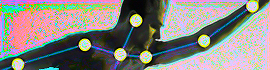

# ofxYolo26

<br>

Ultralytics YOLO26 ONNX models in openFrameworks.

A C++ port of the inference half of [yolo-touchdesigner](https://github.com/torinmb/yolo-touchdesigner).
It runs the same `.onnx` exports, but through onnxruntime via
[ofxOnnxRuntime](https://github.com/hanasaan/ofxOnnxRuntime) instead of
onnxruntime-web/WebGPU in a browser. The reference project's server half — the
Web Server DAT, the WebSocket transport, the binary framing protocol — is
deliberately not ported; in openFrameworks you already have the pixels.

**Status:** first pass. Monocular depth (`yolo26n-depth.onnx`) only. Detection,
pose, segmentation and OBB share the same preprocessing and session plumbing and
are the natural next additions.

## Dependencies

- [ofxOnnxRuntime](https://github.com/hanasaan/ofxOnnxRuntime)

## Setup

Copy a depth model into your project's data folder:

```
bin/data/models/yolo26n-depth.onnx
```

The example expects it at that path. Models live in the reference project under
`reference/yolo-touchdesigner/public/models/`.

## Usage

Blocking, one frame at a time:

```cpp
ofxYolo26::Depth depth;
depth.setup("models/yolo26n-depth.onnx");

const ofxYolo26::DepthMap & map = depth.update(pixels);
float d = map.getValueAtSource(mouseX, mouseY);   // source-image coordinates
```

Live video, with inference on a background thread:

```cpp
// setup()
depthThread.setup("models/yolo26n-depth.onnx");
depthThread.start();

// update()
if (grabber.isFrameNew()) depthThread.setInput(grabber.getPixels());
if (depthThread.isFrameNew()) {
    ofxYolo26::toColorPixels(depthThread.getDepthMap(), pixels);
    texture.loadData(pixels);
}
```

Frames handed to `setInput()` while the worker is busy are dropped rather than
queued, so results stay as close to live as the model allows.

## What the numbers mean

`DepthMap::values` holds the model's output untouched — no normalisation, no
inversion — matching what the reference app ships to TouchDesigner. Larger
values are further away.

Ultralytics documents the YOLO26 depth export as metric depth in metres. The
model bundled with the reference project describes itself as
`YOLO26n-depth-log` in its ONNX metadata, so treat the absolute scale as the
model's business and rely on the relative ordering unless you have calibrated
against something known. On a 640x640 input the raw range typically lands
somewhere around 0.8–2.5.

## Coordinates and letterboxing

Source frames are fitted into the model's 640x640 input with aspect ratio
preserved and the remainder padded black — the same thing the reference app's
webcam path does via canvas `drawImage()`. `ResizeMode::Stretch` is available
if you would rather fill the input, matching the reference app's TouchDesigner
binary path where the host has already sized the frame.

`DepthMap::letterbox` carries the mapping, so results trace back to the frame
you handed in:

```cpp
map.getValueAtSource(x, y);              // source-image pixels
map.getValueAtSourceNormalized(u, v);    // 0..1 across the source frame
map.letterbox.destToSource({dx, dy});
```

Two consequences of letterboxing worth knowing:

- The padding bars get their own hallucinated depth, so `minValue`/`maxValue`
  and the conversion helpers' auto-scaling are computed over the **content
  region only**, and `cropToContent` defaults to true.
- The model bleeds slightly across the content/padding boundary, leaving a
  thin edge artifact on the padded sides. This is inherent to letterboxing and
  the reference app has it too. `ResizeMode::Stretch` avoids it at the cost of
  distorting the image.

## Display helpers

```cpp
ofxYolo26::toFloatPixels(map, floatPixels);        // raw values, 1 channel
ofxYolo26::toNormalizedPixels(map, floatPixels);   // rescaled to 0..1
ofxYolo26::toColorPixels(map, pixels);             // through a colour ramp
```

Each takes an optional explicit `rangeMin`/`rangeMax` (pass `rangeMax <= rangeMin`
to auto-scale from the map), an `invert` flag, and `cropToContent`.

## Example

`example/` shows a still image or a webcam alongside its depth map, with a
mouse probe reading raw depth in source coordinates.

- `space` — switch between the still and the webcam
- `c` — colour ramp / greyscale
- `i` — invert (bright = near)
- `x` — show or crop the letterbox padding
- `d` — dump depth statistics to the console

## Performance

The onnxruntime build shipped with ofxOnnxRuntime is 1.10.0, CPU-only on macOS
— it has no CoreML execution provider compiled in. Expect roughly 80 ms per
640x640 depth inference on an Apple Silicon laptop, hence `DepthThread`.
`Settings::inferType` exposes CUDA and TensorRT for platforms where you have
swapped in a runtime that supports them.

## Verification

The port was checked against the Python onnxruntime reference running the same
model with the same letterbox preprocessing.

Preprocessing, on a lossless 1280x720 source at an exact 2:1 downscale: no
pixel of the tensor differs from PIL's box filter by more than one 8-bit level
(mean 0.28 levels). The residual is PIL quantising its resampled image back to
uint8, where this keeps the box average in float.

Depth output, same source, over the content region:

| | python | c++ | diff |
|---|---|---|---|
| content min | 0.8291 | 0.8322 | 0.37% |
| content max | 1.4835 | 1.4839 | 0.03% |
| centre | 1.0705 | 1.0737 | 0.30% |
| corners | 0.8489–0.9593 | 0.8521–0.9613 | ≤0.37% |

Letterbox geometry matches exactly (640x360 content, pad 0,140), and
`getValueAtSource()` on the source corners returns exactly the content-region
corners.

## Notes

- Model paths are resolved with `ofToDataPath()`.
- `example/bin/data/models/*.onnx` is gitignored — the depth model is 20 MB.
- ofxOnnxRuntime's `addon_config.mk` needed a fix to link under the openFrameworks
  makefiles: openFrameworks runs addon LDFLAGS through `$(call uniq,...)`, which
  collapsed the repeated `-Xlinker` in `-Xlinker -rpath -Xlinker @executable_path`
  and left `@executable_path` as a stray linker argument. It now uses the
  single-token `-Wl,-rpath,...` form, plus a second rpath for the makefile
  build's bundle layout.

## License

AGPL-3.0, see LICENSE.txt — matching yolo-touchdesigner, which this ports from,
and the Ultralytics YOLO models themselves.
